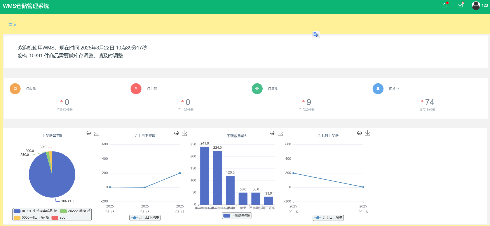
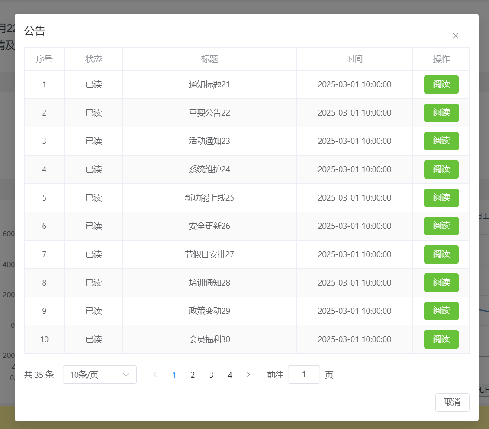
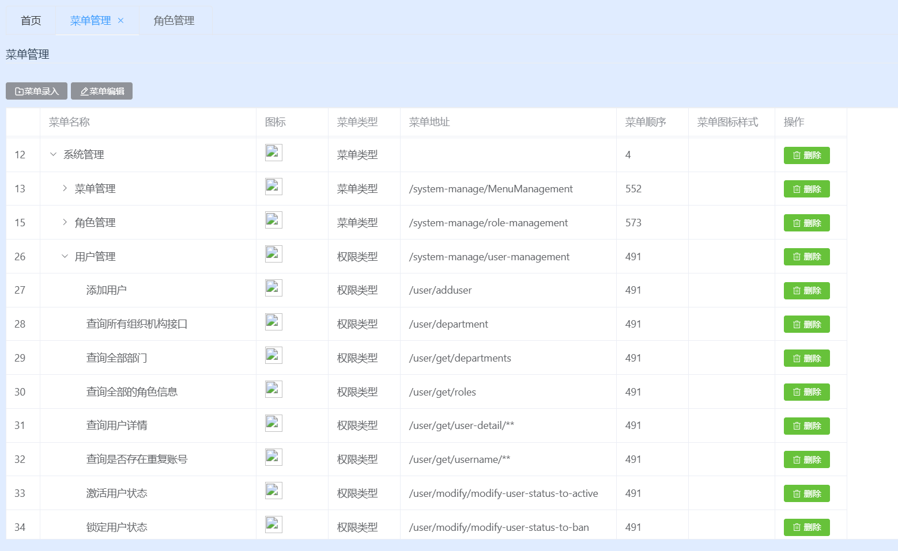
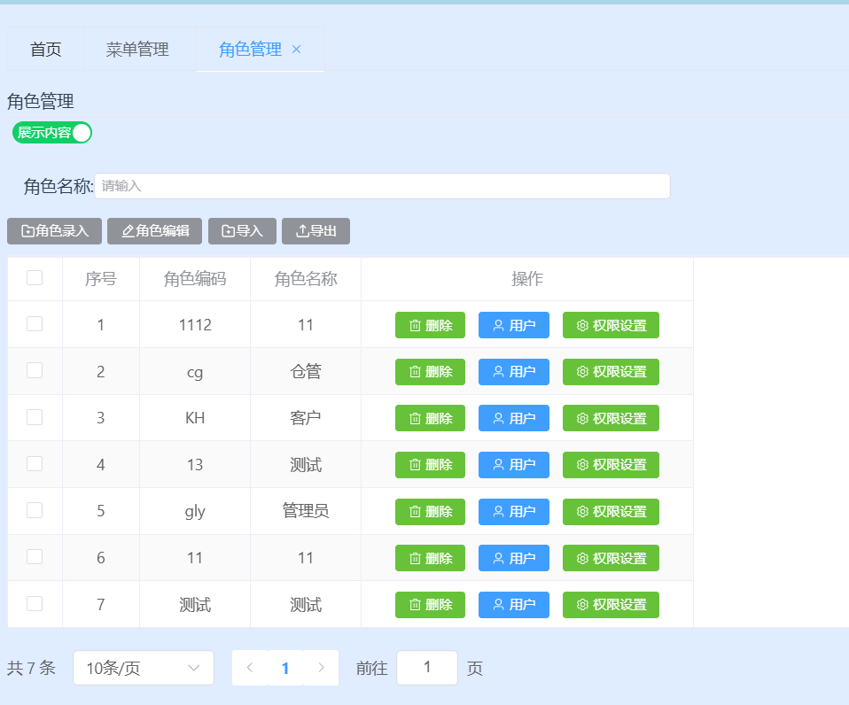
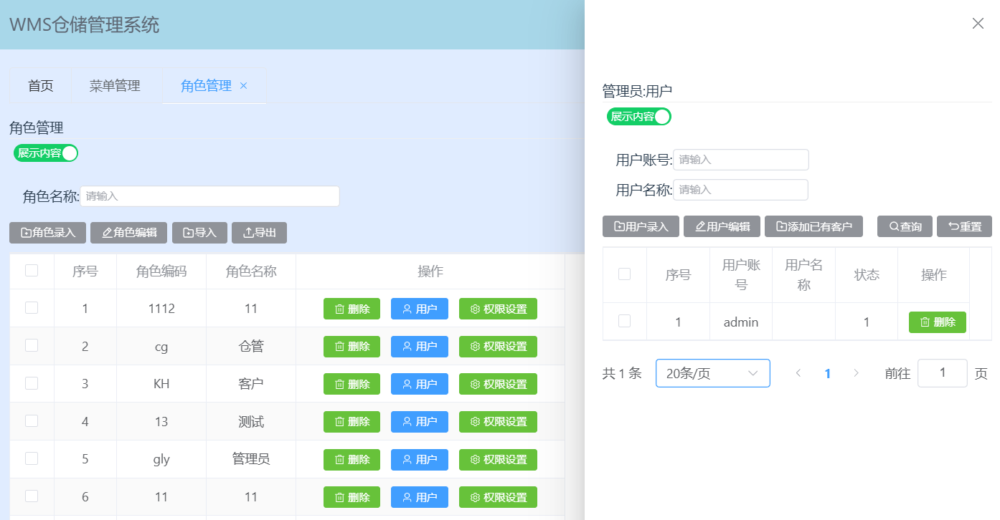

# **`Zero-One-10wms`**

Reference for the concept of `WMS`:

- https://en.wikipedia.org/wiki/Warehouse_management_system
- https://baike.baidu.com/item/%E4%BB%93%E5%BA%93%E7%AE%A1%E7%90%86/9163356

## **Project Overview**

A Warehouse Management System (`WMS`) is a software solution that provides visibility into an enterprise's entire inventory and manages fulfillment operations across the supply chain, from distribution centers to store shelves. By coordinating and optimizing resource utilization and material flow, it helps businesses maximize labor, space, and invested equipment. It is designed to meet the demands of the entire global supply chain, including distribution, manufacturing, asset-intensive, and service-based businesses.

In today's dynamic, omnichannel fulfillment economy, online consumers expect to purchase, fulfill orders, and return products anytime and anywhere. This requires businesses to use appropriate warehouse management software to enhance fulfillment capabilities and quickly respond to customer demands.

`zero-one-10wms` is designed to help you meet the future needs of the supply chain by aligning inventory management and fulfillment services with modern purchasing methods. It provides real-time visibility into your entire inventory. As long as there is internet access, users can track inventory in real time via smartphones and browsers.

## **System Architecture**

The project is built on the `Spring Cloud Alibaba` ecosystem, utilizing `MySQL` for data persistence, and the front end is developed with the `Vue3` ecosystem and `Element Plus UI` framework. The project also supports `C++` microservice development and integration while using `Jenkins` for `CD/CI`.

## **Project Structure**

> `zero-one-10wms`
>
> > `.gitignore` -- Git ignore file
> >
> > `README.md` -- Project README file
> >
> > `documents` -- Documentation resources (environment setup, coding standards, project requirements, etc.)
> >
> > `wms-java` -- Main Java project
> >
> > `wms-cpp` -- Main C++ project
> >
> > `wms-frontend` -- Main frontend project

## **Software Architecture**

### **Java Tech Stack**

#### **Core Backend Tech Stack**

Version compatibility reference:

https://github.com/alibaba/spring-cloud-alibaba/wiki/%E7%89%88%E6%9C%AC%E8%AF%B4%E6%98%8E

| Technology               | Description                 | Version         | Notes |
|--------------------------|----------------------------|----------------|-------|
| `Spring`                 | Container                   | 5.2.15         | [Spring](https://spring.io/) |
| `Spring Web MVC`         | MVC framework              | 5.2.15         | [Spring Web MVC](https://docs.spring.io/spring/docs/current/spring-framework-reference/web.html) |
| `Beanvalidation`         | Entity attribute validation | 2.0.2          | [Beanvalidation](https://beanvalidation.org/2.0-jsr380/) |
| `MyBatis`                | ORM framework              | 3.5.7          | [MyBatis](http://www.mybatis.org/mybatis-3/zh/index.html) |
| `MyBatis Plus`           | MyBatis enhancement tool    | 3.4.3.4        | [MyBatis Plus](https://baomidou.com/) |
| `MyBatis Plus Generator` | Code generator             | 3.5.1          | [MyBatis Plus Generator](https://github.com/baomidou/generator) |
| `Druid`                  | Database connection pool   | 1.2.8          | [Druid](https://github.com/alibaba/druid) |
| `Lombok`                 | Java entity helper tool    | 1.18.20        | [Lombok](https://github.com/rzwitserloot/lombok) |
| `Hutool`                 | Java utility library       | 5.8.3          | [Hutool](https://hutool.cn/docs/#/) |
| `Knife4j`                | API documentation tool     | 2.0.8          | [Knife4j](https://gitee.com/xiaoym/knife4j) |
| `Nimbus JOSE JWT`        | JSON Web Token (JWT)       | 8.21           | [Nimbus JWT](https://bitbucket.org/connect2id/nimbus-jose-jwt/wiki/Home) |
| `Spring Boot`            | Spring Boot framework      | 2.3.12         | [Spring Boot](https://spring.io/projects/spring-boot) |
| `Spring Cloud`           | Microservices framework    | `Hoxton.SR12`  | [Spring Cloud](https://spring.io/projects/spring-cloud) |
| `Spring Cloud Alibaba`   | Alibaba microservices tools | 2.2.8         | [Spring Cloud Alibaba](https://github.com/alibaba/spring-cloud-alibaba/wiki) |
| `Spring Cloud Security`  | Authentication & Authorization | 2.2.5      | [Spring Cloud Security](https://spring.io/projects/spring-cloud-security) |
| `Sentinel`               | Distributed system protection | 1.8.4        | [Sentinel](https://sentinelguard.io/zh-cn/) |
| `Seata`                  | Distributed transaction solution | 1.5.1    | [Seata](https://seata.io/zh-cn/) |
| `MapStruct`              | Code generator for entity mapping | `1.5.3.Final` | [MapStruct](https://mapstruct.org/) |

#### **Extended Backend Tech Stack**  

| Technology                | Description               | Version | Notes |
|---------------------------|--------------------------|---------|-------|
| `EasyExcel`               | Excel report tool        | 3.0.5   | [EasyExcel](https://github.com/alibaba/easyexcel) |
| `RocketMQ`                | Message queue middleware | 4.9.3   | [RocketMQ](https://github.com/alibaba/spring-cloud-alibaba/wiki/RocketMQ) |
| `WebSocket`               | Real-time communication  | 5.2.15  | [WebSocket](https://docs.spring.io/spring-framework/docs/5.3.15/reference/html/web.html#websocket) |
| `FastDFS`                 | Distributed file system  | 2.0.1   | [FastDFS](https://gitee.com/zero-awei/fastdfs-spring-boot-starter) |
| `Elasticsearch`           | Distributed search engine | 7.6.2  | [Elasticsearch](https://www.elastic.co/guide/en/elasticsearch/reference/7.6/index.html) |
| `LogStash`                | Log collection tool      | 7.6.2   | [LogStash](https://www.elastic.co/guide/en/logstash/7.6/index.html) |
| `Kibana`                  | Log visualization tool   | 7.6.2   | [Kibana](https://www.elastic.co/guide/en/kibana/7.6/index.html) |
| `logstash-logback-encoder` | Logstash log collection plugin | 6.6 | [Logstash Logback Encoder](https://github.com/logfellow/logstash-logback-encoder/tree/logstash-logback-encoder-6.6) |
| `spring-boot-admin`       | Service monitoring panel | 2.3.1   | [Spring Boot Admin](https://github.com/codecentric/spring-boot-admin) |
| `EasyEs`                  | Elasticsearch ORM framework | 1.0.3  | [EasyEs](https://www.easy-es.cn/) |
| `spring-data-mongodb`     | Spring MongoDB integration | 3.0.9  | [Spring Data MongoDB](https://docs.spring.io/spring-data/mongodb/docs/3.0.9.RELEASE/reference/html/#preface) |
| `AJ-Captcha`              | Captcha plugin          | 1.3.0   | [AJ-Captcha](https://ajcaptcha.beliefteam.cn/captcha-doc/) |
| `x-easypdf`               | PDF plugin              | 2.12.2  | [x-easypdf](https://gitee.com/dromara/x-easypdf) |

### `Frontend` Tech Stack

#### Core Tech Stack

| Technology     | Description             | Version  | Notes |
|---------------|-------------------------|----------|-------|
| `Vue`         | Frontend framework       | `v3.x`   | [Vue.js](https://v3.vuejs.org/) |
| `Vue-Router`  | Routing framework        | `v4.x`   | [Vue Router](https://next.router.vuejs.org/) |
| `Pinia`       | Global state management  | `v2.x`   | [Pinia](https://pinia.vuejs.org/) |
| `Axios`       | HTTP middleware          | v1.7.2   | [Axios](https://github.com/axios/axios) |
| `Element-Plus` | UI framework             | `latest` | [Element Plus](https://element-plus.gitee.io/zh-CN/) |

#### **Extended Tech Stack**  

| Technology              | Description         | Version  | Notes |
|-------------------------|---------------------|----------|-------|
| `ECharts`               | Charting framework  | `latest` | [ECharts](https://echarts.apache.org/handbook/zh/get-started/) |
| `AJ-Captcha`            | Captcha plugin     | 1.3.0    | [AJ-Captcha](https://ajcaptcha.beliefteam.cn/captcha-doc/) |
| `SheetJS`               | Spreadsheet plugin  | 0.20.2   | [SheetJS](https://docs.sheetjs.com/docs/) |
| `vue-plugin-hiprint`    | Printing plugin     | 0.0.56   | [Hiprint](https://gitee.com/CcSimple/vue-plugin-hiprint) |
| `wangEditor`            | Rich text editor    | v5       | [wangEditor](https://www.wangeditor.com/v5/) |
| `pdfobject`             | PDF preview plugin  | 2.3.0    | [PDFObject](https://github.com/pipwerks/PDFObject) |
| `Vitest`                | Testing framework   | 1.6.0    | [Vitest](https://cn.vitest.dev/) |

### `C++` Tech Stack

#### Core Backend Tech Stack

| Technology | Description | Version | Notes |
|------------|------------|---------|-------|
| `oat++` | Web framework | `1.3.0` | https://github.com/oatpp/oatpp |
| `MySQL Connector` | MySQL connection driver | 8.0.27 | https://dev.mysql.com/doc/connector-cpp/1.1/en/connector-cpp-apps.html |
| `JWT` | JSON Web Token | v1.4 | https://opensourcelibs.com/lib/cpp-jwt |
| `OpenSSL` | Open-source security protocol | `1.1.1L` | https://www.openssl.org/ |

#### **Extended Backend Tech Stack**  

| Technology   | Description                | Version  | Notes |
|-------------|----------------------------|----------|-------|
| `xlnt`      | Excel report tool          | 1.5.0    | [xlnt](https://github.com/tfussell/xlnt) |
| `fastdfs`   | File storage client        | latest   | [FastDFS](https://gitee.com/fastdfs100) |
| `yaml-cpp`  | YAML data parser           | 0.7.0    | [yaml-cpp](https://github.com/jbeder/yaml-cpp) |
| `nacos`     | Nacos client               | `v1.1.0` | [Nacos SDK C++](https://github.com/nacos-group/nacos-sdk-cpp) |
| `redis++`   | Redis connection client    | 1.3.2    | [redis-plus-plus](https://github.com/sewenew/redis-plus-plus) |
| `rocketmq`  | RocketMQ client            | 2.1.0    | [RocketMQ C++](https://github.com/apache/rocketmq-client-cpp) |
| `mongo`     | MongoDB client             | 3.6.5    | [MongoDB C++ Driver](https://www.mongodb.com/docs/drivers/cxx/) |
| `libharu`   | PDF library                | 2.4.3    | [libharu](https://github.com/libharu/libharu/tree/v2.4.3) |
| `zxing`     | Barcode & QR code generator | 2.1.0    | [zxing-cpp](https://github.com/zxing-cpp/zxing-cpp/tree/v2.1.0) |

## Environment Requirements

### Development Tools

| Tool           | Description                | Version    | Notes |
|---------------|----------------------------|------------|-------|
| `Navicat`     | Database connection tool   | latest     | [Navicat](https://www.navicat.com.cn/) |
| `RDM`         | Redis visualization tool   | latest     | [RedisDesktopManager](https://github.com/uglide/RedisDesktopManager) / [AnotherRedisDesktopManager](https://gitee.com/qishibo/AnotherRedisDesktopManager) |
| `PowerDesigner` | Database design tool     | 16.6       | [PowerDesigner](http://powerdesigner.de/) |
| `Axure`       | Prototype design tool      | 9          | [Axure](https://www.axure.com/) |
| `MindMaster`  | Mind mapping tool          | latest     | [MindMaster](http://www.edrawsoft.cn/mindmaster) |
| `Visio`       | Flowchart tool             | latest     | [Visio](https://www.microsoft.com/zh-cn/microsoft-365/visio/flowchart-software) |
| `Apipost`     | API debugging tool         | latest     | [Apipost](https://www.apipost.cn/) |
| `Mock.js`     | API mock testing           | latest     | [Mock.js](http://mockjs.com/) |
| `Git`         | Version control            | latest     | [Git](https://git-scm.com/) |
| `Codeup`      | Source code hosting        | latest     | [Codeup](https://codeup.aliyun.com) |
| `Projex`      | DevOps process management  | latest     | [Projex](https://devops.aliyun.com/projex) |
| `IDEA`        | Java IDE                   | 2022.1.3+  | [IntelliJ IDEA](https://www.jetbrains.com/idea/download) |
| `Apache Maven` | Build tool                | 3.6.3      | [Maven](https://maven.apache.org/) |
| `Docker Maven` | Maven Docker plugin      | 0.40.2     | [Docker Maven Plugin](https://dmp.fabric8.io/) |
| `VS`          | C++ IDE                    | 2022       | [Visual Studio](https://learn.microsoft.com/en-us/visualstudio/releases/2022/release-notes) |
| `Cmake`       | C++ cross-platform build   | latest     | [CMake](https://cmake.org/cmake/help/latest/index.html) |
| `gtest`       | C++ testing framework      | 1.14.0     | [Google Test](https://github.com/google/googletest) |
| `VS Code`     | Frontend development IDE   | latest     | [VS Code](https://code.visualstudio.com/Download) |

### Development Environment

| Dependency | Version | Notes |
|-----------|---------|-------|
| `Windows` | 10+ | Operating system |
| `JDK` | 1.8.0_191+ | https://www.injdk.cn/ |
| `NodeJS` | 20.15.0 | https://nodejs.org/zh-cn/ |
| `NPM` | 8.19.2 | https://www.npmjs.com/ |

### Server Environment

| Dependency   | Version   | Notes |
|-------------|----------|-------|
| `Anolis OS` | `8.6GA`  | [Anolis OS](https://openanolis.cn/anolisos) |
| `Docker`    | latest   | [Docker](https://www.docker.com/) |
| `MySQL`     | 8.0.20   | [MySQL](https://www.mysql.com/cn/) |
| `Redis`     | 6.2.7    | [Redis](https://redis.io/) |
| `Nacos`     | 2.1.0    | [Nacos](https://nacos.io/zh-cn/docs/quick-start-docker.html) |
| `Sentinel`  | 1.8.4    | [Sentinel](https://github.com/alibaba/Sentinel/releases) |
| `Seata`     | 1.5.1    | [Seata](https://github.com/seata/seata) |
| `RocketMQ`  | 4.9.3    | [RocketMQ](https://rocketmq.apache.org/) |
| `Nginx`     | latest   | [Nginx](https://nginx.org/en/) |
| `FastDFS`   | V6.07    | [FastDFS](https://github.com/happyfish100/fastdfs/releases/tag/V6.07) |
| `ELK`       | 7.6.2    | [ELK Stack](https://www.elastic.co/guide/en/elastic-stack/7.6/index.html) |
| `MongoDB`   | 4.4.17   | [MongoDB](https://www.mongodb.com/try/download/community) |
| `Jenkins`   | latest   | [Jenkins](https://www.jenkins.io/zh/doc/book/installing/) |

## Preview Images

System Login

Dashboard

Notice

Resource Management

Role Management

## Special Thanks

The development of `zero-one-10wms` would not have been possible without the support of open-source software and the community. Special thanks to the following projects and their maintainers:

- `spring`: https://github.com/spring-projects
- `alibaba`: https://github.com/alibaba
- `mybatis`: https://github.com/mybatis/mybatis-3.git
- `vue`: https://github.com/vuejs
- `oatpp`: https://github.com/oatpp/oatpp

And many other open-source components and contributors who are not explicitly listed.

---

# `zero-one-10wms`

`WMS`概念定义参考：

- https://en.wikipedia.org/wiki/Warehouse_management_system
- https://baike.baidu.com/item/%E4%BB%93%E5%BA%93%E7%AE%A1%E7%90%86/9163356

## 项目简介

仓储管理系统（`WMS`）是一种软件解决方案，它提供对企业整个库存的可见性，可管理从配送中心到商店货架的整个供应链履行运营。通过协调和优化资源使用与物料流动，助力企业充分利用劳动力、空间以及所投资的设备。旨在满足整个全球供应链的需求，包括分销、制造、资产密集型和服务业务。

在当今动态、全渠道的履行经济中，网购消费者希望随时随地都能进行购买、订单履行和退货。这要求企业使用适当的仓库管理软件来提高履行能力，快速响应客户需求。

`zero-one-10wms`旨在帮助您满足未来的供应链需求，将库存管理和履行服务与现代采购方法相匹配，并提供对整个库存的实时可见性。只要有互联网，用户就可以通过智能手机和浏览器实时了解库存。

## 系统架构图

项目主体骨架基于`Spring Cloud Alibaba`生态体系，使用`MySQL`进行数据持久化管理，采用`Vue3`生态体系与`Element Puls UI`框架完成前端制作，同时项目提供`C++`微服务开发解决方案与集成、使用`Jenkins`实现`CD/CI`。

## 项目结构说明
> `zero-one-10wms` 
>
> > `.gitignore` -- 忽略提交配置
> >
> > `README.md` -- 项目自述文件
> >
> > `documents` -- 环境搭建、编码规范、项目需求等等文档资源
> >
> > `wms-java` -- `Java`项目主体
> >
> > `wms-cpp` -- `C++`项目主体
> >
> > `wms-frontend` -- 前端项目主体

## 软件架构

### `Java`技术栈

#### 后端核心技术栈

版本匹配参考：

https://github.com/alibaba/spring-cloud-alibaba/wiki/%E7%89%88%E6%9C%AC%E8%AF%B4%E6%98%8E

| 技术                     | 说明                   | 版本          | 备注                                                         |
| ------------------------ | ---------------------- | ------------- | ------------------------------------------------------------ |
| `Spring`                 | 容器                   | 5.2.15        | https://spring.io/                                           |
| `Spring Web MVC`         | `MVC`框架              | 5.2.15        | https://docs.spring.io/spring/docs/current/spring-framework-reference/web.html |
| `Beanvalidation`         | 实体属性校验           | 2.0.2         | https://beanvalidation.org/2.0-jsr380/ https://www.baeldung.com/spring-boot-bean-validation |
| `MyBatis`                | `ORM`框架              | 3.5.7         | http://www.mybatis.org/mybatis-3/zh/index.html               |
| `MyBatis Plus`           | `MyBatis`的增强工具    | 3.4.3.4       | https://baomidou.com/                                        |
| `MyBatis Plus Generator` | 代码生成器             | 3.5.1         | https://github.com/baomidou/generator                        |
| `Druid`                  | 数据库连接池           | 1.2.8         | https://github.com/alibaba/druid                             |
| `Lombok`                 | 实体类增加工具         | 1.18.20       | https://github.com/rzwitserloot/lombok                       |
| `Hutool`                 | Java工具类库           | 5.8.3         | https://hutool.cn/docs/#/                                    |
| `Knife4j`                | 接口描述语言           | 2.0.8         | https://gitee.com/xiaoym/knife4j                             |
| `Nimbus JOSE JWT`        | `JSON Web Token`       | 8.21          | https://bitbucket.org/connect2id/nimbus-jose-jwt/wiki/Home   |
| `Spring Boot`            | Spring快速集成脚手架   | 2.3.12        | https://spring.io/projects/spring-boot                       |
| `Spring Cloud`           | 微服务框架             | `Hoxton.SR12` | https://spring.io/projects/spring-cloud                      |
| `Spring Cloud Alibaba`   | 微服务框架             | 2.2.8         | https://github.com/alibaba/spring-cloud-alibaba/wiki         |
| `Spring Cloud Security`  | 认证和授权框架         | 2.2.5         | https://spring.io/projects/spring-cloud-security             |
| `Sentinel`               | 分布式系统的流量防卫兵 | 1.8.4         | https://sentinelguard.io/zh-cn/                              |
| `Seata`                  | 分布式事务解决方案     | 1.5.1         | https://seata.io/zh-cn/                                      |
| `MapStruct`              | 实体类映射代码生成器   | `1.5.3.Final` | https://mapstruct.org/                                       |

#### 后端扩展技术栈

版本匹配参考：

https://docs.spring.io/spring-data/elasticsearch/docs/current/reference/html/#preface.requirements

https://docs.spring.io/spring-data/mongodb/docs/current/reference/html/#requirements

| 技术                       | 说明                   | 版本   | 备注                                                         |
| -------------------------- | ---------------------- | ------ | ------------------------------------------------------------ |
| `EasyExcel`                | Excel报表              | 3.0.5  | https://github.com/alibaba/easyexcel                         |
| `RocketMQ`                 | 消息队列中间件         | 4.9.3  | https://github.com/alibaba/spring-cloud-alibaba/wiki/RocketMQ |
| `WebSocket`                | 及时通讯服务           | 5.2.15 | https://docs.spring.io/spring-framework/docs/5.3.15/reference/html/web.html#websocket |
| `FastDFS`                  | `dfs`客户端            | 2.0.1  | https://gitee.com/zero-awei/fastdfs-spring-boot-starter      |
| `Elasticsearch`            | 分布式搜索和分析引擎   | 7.6.2  | https://www.elastic.co/guide/en/elasticsearch/reference/7.6/index.html |
| `LogStash`                 | 日志收集工具           | 7.6.2  | https://www.elastic.co/guide/en/logstash/7.6/index.html      |
| `Kibana`                   | 日志可视化查看工具     | 7.6.2  | https://www.elastic.co/guide/en/kibana/7.6/index.html        |
| `logstash-logback-encoder` | `Logstash`日志收集插件 | 6.6    | https://github.com/logfellow/logstash-logback-encoder/tree/logstash-logback-encoder-6.6 |
| `spring-boot-admin`        | 服务管理和监控面板     | 2.3.1  | https://github.com/codecentric/spring-boot-admin             |
| `EasyEs`                   | `ES ORM`开发框架       | 1.0.3  | https://www.easy-es.cn/                                      |
| `spring-data-mongodb`      | `Spring`集成`MongoDB`  | 3.0.9  | https://docs.spring.io/spring-data/mongodb/docs/3.0.9.RELEASE/reference/html/#preface |
| `AJ-Captcha`               | 验证码插件             | 1.3.0  | https://ajcaptcha.beliefteam.cn/captcha-doc/                 |
| `x-easypdf`                | `pdf`插件              | 2.12.2 | https://gitee.com/dromara/x-easypdf                          |

### 前端技术栈

#### 核心技术栈

| 技术           | 说明             | 版本                                                         | 备注                                 |
| -------------- | ---------------- | ------------------------------------------------------------ | ------------------------------------ |
| `Vue`          | 前端框架         | `v3.x`                                                       | https://v3.vuejs.org/                |
| `Vue-Router`   | 路由框架         | `v4.x`                                                       | https://next.router.vuejs.org/       |
| `Pinia`        | 全局状态管理框架 | `v2.x`                                                       | https://pinia.vuejs.org/             |
| `Axios`        | HTTP中间件       | [v1.7.2](https://github.com/axios/axios/releases/tag/v1.7.2) | https://github.com/axios/axios       |
| `Element-Plus` | 前端`UI`框架     | `latest`                                                     | https://element-plus.gitee.io/zh-CN/ |

#### 扩展技术栈

| 技术                 | 说明          | 版本   | 备注                                                         |
| -------------------- | ------------- | ------ | ------------------------------------------------------------ |
| `ECharts`            | 图表框架      | latest | [`Apache ECharts`](https://echarts.apache.org/handbook/zh/get-started/) |
| `AJ-Captcha`         | 验证码插件    | 1.3.0  | https://ajcaptcha.beliefteam.cn/captcha-doc/                 |
| `SheetJS`            | 电子表格插件  | 0.20.2 | https://docs.sheetjs.com/docs/ https://docs.sheetjs.com/docs/demos/frontend/vue |
| `vue-plugin-hiprint` | 打印插件      | 0.0.56 | https://gitee.com/CcSimple/vue-plugin-hiprint                |
| `wangEditor`         | 富文本编辑器  | v5     | https://www.wangeditor.com/v5/                               |
| `pdfobject`          | `pdf`预览插件 | 2.3.0  | https://github.com/pipwerks/PDFObject                        |
| `Vitest`             | 测试框架      | 1.6.0  | https://cn.vitest.dev/ https://cn.vuejs.org/guide/scaling-up/testing.html |

### `CPP`技术栈

#### 后端核心技术栈

| 技术              | 说明               | 版本                                                   | 备注                                                         |
| ----------------- | ------------------ | ------------------------------------------------------ | ------------------------------------------------------------ |
| `oat++`           | Web框架            | `1.3.0`                                                | https://github.com/oatpp/oatpp                               |
| `MySQL Connector` | `MySQL`连接驱动库  | 8.0.27                                                 | https://dev.mysql.com/downloads/connector/cpp/ https://dev.mysql.com/doc/connector-cpp/1.1/en/connector-cpp-apps.html |
| `JWT`             | `JSON` Web Token   | [v1.4](https://github.com/arun11299/cpp-jwt/tree/v1.4) | https://opensourcelibs.com/lib/cpp-jwt                       |
| `OpenSSL`         | 开源安全套接层协议 | `1.1.1L`                                               | https://www.openssl.org/ https://www.xolphin.com/support/OpenSSL/OpenSSL_-_Installation_under_Windows |

#### 后端扩展技术栈

| 技术       | 说明              | 版本     | 备注                                               |
| ---------- | ----------------- | -------- | -------------------------------------------------- |
| `xlnt`     | excel报表         | 1.5.0    | https://github.com/tfussell/xlnt                   |
| `fastdfs`  | 文件存储客户端    | latest   | https://gitee.com/fastdfs100                       |
| `yaml-cpp` | 解析`yaml`数据    | 0.7.0    | https://github.com/jbeder/yaml-cpp                 |
| `nacos`    | `nacos`客户端     | `v1.1.0` | https://github.com/nacos-group/nacos-sdk-cpp       |
| `redis++`  | `redis`连接客户端 | 1.3.2    | https://github.com/sewenew/redis-plus-plus         |
| `rocketmq` | `rokcetmq`客户端  | 2.1.0    | https://github.com/apache/rocketmq-client-cpp      |
| `mongo`    | `mongodb`客户端   | 3.6.5    | https://www.mongodb.com/docs/drivers/cxx/          |
| `libharu`  | `pdf`库           | 2.4.3    | https://github.com/libharu/libharu/tree/v2.4.3     |
| `zxing`    | 用于绘制各种码    | 2.1.0    | https://github.com/zxing-cpp/zxing-cpp/tree/v2.1.0 |

## 环境要求

### 开发工具

| 工具            | 说明                  | 版本      | 备注                                                         |
| --------------- | --------------------- | --------- | ------------------------------------------------------------ |
| `Navicat`       | 数据库连接工具        | latest    | https://www.navicat.com.cn/                                  |
| `RDM`           | `Redis`可视化管理工具 | latest    | https://github.com/uglide/RedisDesktopManager https://gitee.com/qishibo/AnotherRedisDesktopManager |
| `PowerDesigner` | 数据库设计工具        | 16.6      | http://powerdesigner.de/                                     |
| `Axure`         | 原型设计工具          | 9         | https://www.axure.com/                                       |
| `MindMaster`    | 思维导图设计工具      | latest    | http://www.edrawsoft.cn/mindmaster                           |
| `Visio`         | 流程图绘制工具        | latest    | https://www.microsoft.com/zh-cn/microsoft-365/visio/flowchart-software |
| `Apipost`       | `API`接口调试工具     | latest    | https://www.apipost.cn/                                      |
| `Mock.js`       | `API`接口模拟测试     | latest    | http://mockjs.com/                                           |
| `Git`           | 项目版本管控工具      | latest    | https://git-scm.com/                                         |
| `Codeup`        | 项目源码托管平台      | latest    | https://codeup.aliyun.com                                    |
| `Projex`        | 开发过程管控平台      | latest    | https://devops.aliyun.com/projex                             |
| `IDEA`          | `Java`开发`IDE`       | 2022.1.3+ | https://www.jetbrains.com/idea/download                      |
| `Apache Maven`  | Maven 构建工具        | 3.6.3     | https://maven.apache.org/                                    |
| `Docker Maven`  | Maven Docker插件      | 0.40.2    | https://dmp.fabric8.io/ https://github.com/fabric8io/docker-maven-plugin |
| `VS`            | `C++`开发`IDE`        | 2022      | https://learn.microsoft.com/en-us/visualstudio/releases/2022/release-notes |
| `Cmake`         | `C++`跨平台编译       | latest    | https://cmake.org/cmake/help/latest/index.html               |
| gtest           | 测试框架              | 1.14.0    | https://github.com/google/googletest                         |
| `VS Code`       | 前端开发`IDE`         | latest    | https://code.visualstudio.com/Download                       |

### 开发环境

| 依赖环境  | 版本       | 备注                      |
| --------- | ---------- | ------------------------- |
| `Windows` | 10+        | 操作系统                  |
| `JDK`     | 1.8.0_191+ | https://www.injdk.cn/     |
| `NodeJS`  | 20.15.0    | https://nodejs.org/zh-cn/ |
| `NPM`     | 8.19.2     | https://www.npmjs.com/    |

### 服务器环境

| 依赖环境    | 版本                                                         | 备注                                                         |
| ----------- | ------------------------------------------------------------ | ------------------------------------------------------------ |
| `Anolis OS` | `8.6GA`                                                      | https://openanolis.cn/anolisos                               |
| `Docker`    | latest                                                       | https://www.docker.com/                                      |
| `MySQL`     | 8.0.20                                                       | https://www.mysql.com/cn/                                    |
| `Redis`     | 6.2.7                                                        | https://redis.io/                                            |
| `Nacos`     | 2.1.0                                                        | https://nacos.io/zh-cn/docs/quick-start-docker.html          |
| `Sentinel`  | 1.8.4                                                        | https://github.com/alibaba/Sentinel/releases                 |
| `Seata`     | 1.5.1                                                        | https://github.com/seata/seata                               |
| `RocketMQ`  | 4.9.3                                                        | https://rocketmq.apache.org/                                 |
| `Nginx`     | latest                                                       | https://nginx.org/en/                                        |
| `FastDFS`   | [V6.07](https://github.com/happyfish100/fastdfs/releases/tag/V6.07) | https://gitee.com/fastdfs100                                 |
| `ELK`       | 7.6.2                                                        | https://www.elastic.co/guide/en/elastic-stack/7.6/index.html |
| `MongoDB`   | 4.4.17                                                       | https://www.mongodb.com/try/download/community               |
| `Jenkins`   | latest                                                       | https://www.jenkins.io/zh/doc/book/installing/               |

## 特别鸣谢

`zero-one-10wms`的诞生离不开开源软件和社区的支持，感谢以下开源项目及项目维护者：

- `spring`：https://github.com/spring-projects
- `alibaba`：https://github.com/alibaba
- `mybatis`：https://github.com/mybatis/mybatis-3.git
- `mp`：https://github.com/baomidou
- `api`：https://gitee.com/xiaoym/knife4j
- `vue`：https://github.com/vuejs
- `ui`：https://github.com/ElemeFE
- `oatpp`：https://github.com/oatpp/oatpp

同时也感谢其他没有明确写出来的开源组件提供给与维护者。

## 效果预览图

系统登录

首页

公告

资源管理

角色管理

## 支持一下

如果觉得框架和项目还不错，点个⭐Star，这将是对**01星球**极大的鼓励与支持。

想了解更多关于计算机方向选择、学习建议等相关信息，可以关注[**01星球B站主页~**](https://space.bilibili.com/1653229811?spm_id_from=333.1007.0.0)
